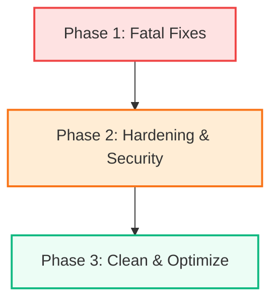

# Production Readiness & Code Quality Audit
**Client / App:** Bank Statement Auditing Desktop Application (Shah Kapadia & Associates)  
**Date:** May 21, 2026  
**Status:** 🔴 **NEEDS REMEDIATION (Not Production Ready)**

---

## Executive Summary

While the **Bank Audit App** boasts a highly modular and modern architecture—employing a local FastAPI backend bridged dynamically to an Electron + React frontend with advanced features like web workers, virtualized tables, and timed-HMAC path protection—it is **not currently production-ready**. 

We have identified several critical failures, architectural bottlenecks, and security hazards that will cause setup issues, resource leaks, or runtime crashes in a packaged production environment.

### 📊 Threat & Severity Matrix

| Category | Critical 🔴 | High 🟠 | Medium 🟡 | Low 🟢 | Total |
|---|:---:|:---:|:---:|:---:|:---:|
| **Security & Compliance** | 2 | 5 | 1 | 0 | **8** |
| **Resilience & Process Lifecycle** | 3 | 1 | 2 | 2 | **8** |
| **Data Integrity & Precision** | 1 | 0 | 2 | 2 | **5** |
| **React Architecture & UI** | 1 | 2 | 5 | 4 | **12** |
| **Build & Dependencies** | 1 | 0 | 3 | 4 | **8** |
| **Total Issues** | **8** | **8** | **13** | **12** | **41** |

---

## 🔴 1. CRITICAL SHOWSTOPPERS (Immediate Action Required)

The following 8 issues must be resolved before compiling a release candidate, as they will directly result in security exposures, app crashes, or broken installation environments.

### C1. Broken Database Migrations (Import Error)
* **File:** [backend/alembic/env.py:10](file:///home/adi/Projects/audit-app/backend/alembic/env.py#L10)
* **Code:** 
  ```python
  from backend.database import Base, DATABASE_URL
  ```
* **Description:** The database module (`backend/database.py`) exports `SYNC_DATABASE_URL` and `ASYNC_DATABASE_URL` but does **not** define or export `DATABASE_URL`. Any attempt to run database migrations during setup or update using `alembic upgrade head` will crash immediately with an `ImportError`.
* **Remediation:** Modify the import in `env.py`:
  ```python
  from backend.database import Base, SYNC_DATABASE_URL as DATABASE_URL
  ```

### C2. Missing `aiosqlite` in Production Requirements
* **File:** [backend/requirements.txt](file:///home/adi/Projects/audit-app/backend/requirements.txt)
* **Description:** The backend's database layer instantiates an asynchronous SQLite connection via `sqlite+aiosqlite:///`. However, `aiosqlite` is omitted from `requirements.txt`. In a fresh environment setup, starting the application will trigger a `ModuleNotFoundError` and block database connectivity.
* **Remediation:** Add the missing driver to `requirements.txt`:
  ```text
  aiosqlite>=0.20.0
  ```

### C3. Electron Renderer Running Unsandboxed
* **File:** [frontend/electron/main.ts:320](file:///home/adi/Projects/audit-app/frontend/electron/main.ts#L320)
* **Code:**
  ```typescript
  webPreferences: {
    preload: join(__dirname, '../preload/index.js'),
    sandbox: false, // <-- Critical Security Flaw
    contextIsolation: true,
    nodeIntegration: false
  }
  ```
* **Description:** Disabling the sandbox inside the renderer process exposes the host operating system. If an attacker manages to execute code in the renderer (via an XSS or a corrupted npm dependency), they bypass Chromium's security layer and gain direct execution rights on the user's computer.
* **Remediation:** Toggle `sandbox: true`. Update preload scripts to ensure compliance with sandboxed runtime limitations (avoiding direct OS imports inside preload).

### C4. Complete Absence of Content Security Policy (CSP)
* **File:** [frontend/index.html](file:///home/adi/Projects/audit-app/frontend/index.html)
* **Description:** The HTML template defines no CSP. A compromised dependency or malicious input can load remote scripts, inject stylesheets, or connect to foreign web servers freely.
* **Remediation:** Add a robust, offline-first CSP `<meta>` header inside the `<head>` of the `index.html`:
  ```html
  <meta http-equiv="Content-Security-Policy" content="default-src 'self'; script-src 'self'; style-src 'self' 'unsafe-inline'; img-src 'self' data:; connect-src 'self' http://127.0.0.1:* ws://127.0.0.1:*;">
  ```

### C5. External CDN Assets (Blocks Offline Execution)
* **Files:** [frontend/index.html:7-9](file:///home/adi/Projects/audit-app/frontend/index.html#L7) and [frontend/src/index.css:1](file:///home/adi/Projects/audit-app/frontend/src/index.css#L1)
* **Description:** The application pulls the fonts "Inter" and "JetBrains Mono" from Google Fonts CDNs on launch. This breaks offline operation for audited CAs (who often work in secure, isolated offline networks), leaks user metadata/telemetry to external CDNs, and fails under strict CSP.
* **Remediation:** Download and package the WOFF2 font files locally in `frontend/src/assets/fonts/` and declare them via `@font-face` rules inside `index.css`.

### C6. Python Backend Crash Recovery Missing
* **File:** [frontend/electron/main.ts](file:///home/adi/Projects/audit-app/frontend/electron/main.ts)
* **Description:** If the FastAPI backend subprocess crashes due to an out-of-memory error (e.g., parsing a massive PDF) or an database lock, the Electron frontend continues running but all network requests fail silently. There is no active monitoring, auto-restart capability, or user-facing error message.
* **Remediation:** Hook into the spawned subprocess exit event inside `main.ts` and dispatch an IPC notification to the frontend:
  ```typescript
  pythonProcess.on('exit', (code, signal) => {
    console.error(`Python backend terminated with code ${code} and signal ${signal}`);
    if (mainWindow && !mainWindow.isDestroyed()) {
      mainWindow.webContents.send('backend-crashed', { code, signal });
    }
  });
  ```

### C7. Missing Global React Error Boundary
* **File:** [frontend/src/App.tsx](file:///home/adi/Projects/audit-app/frontend/src/App.tsx)
* **Description:** Any unhandled runtime exception occurring inside a React component (e.g., reading a null state properties) will bubble to the top level, crash React's virtual DOM, and render a permanent **blank white screen**. The desktop app becomes unresponsive with no recovery avenue.
* **Remediation:** Add a global `<ErrorBoundary>` wrapper component inside `main.tsx` or `App.tsx` that presents a graceful error interface with a button to force-reload the Electron window (`window.location.reload()`).

### C8. Monolithic UI Component (`FileDropZone.tsx` is 954 lines)
* **File:** [frontend/src/components/FileDropZone.tsx](file:///home/adi/Projects/audit-app/frontend/src/components/FileDropZone.tsx)
* **Description:** This file operates as a single React component that orchestrates raw drops, handles local file validations, parses Excel worksheets using `xlsx`, maps column parameters, controls the UI state, and computes background math. It is extremely fragile, highly prone to regression bugs, and impossible to unit-test.
* **Remediation:** Refactor the monolith into isolated sub-components:
  * `FileDropContainer`: Pure visual drop interaction.
  * `ExcelSheetSelector`: Table column mapping.
  * `ParseProgressIndicator`: Renders upload speed, progress, and computed ETA.

---

## 🟠 2. HIGH SEVERITY ISSUES

These issues affect core functionality, pose significant security risks, or degrade long-term code quality.

### H1. Missing Enum Validation on `/review` Status
* **File:** [backend/api/routes/transactions.py:302-313](file:///home/adi/Projects/audit-app/backend/api/routes/transactions.py#L302)
* **Code:**
  ```python
  @router.post("/{transaction_id}/review")
  def update_review_status(transaction_id: int, status: str = Query(...), ...)
  ```
* **Description:** The `status` parameter accepts an unvalidated string. An attacker or client bug could set arbitrary text to the database (e.g., `<script>alert("hack")</script>`), raising risk for database contamination and persistent XSS.
* **Remediation:** Declare a Python `str(Enum)` class in `schemas.py` and enforce it:
  ```python
  class ReviewStatus(str, Enum):
      UNREVIEWED = "unreviewed"
      REVIEWED = "reviewed"
      NEEDS_REVIEW = "needs_review"
      FLAGGED = "flagged"
  ```

### H2. Transaction Notes Passed in Query String
* **File:** [backend/api/routes/transactions.py:315](file:///home/adi/Projects/audit-app/backend/api/routes/transactions.py#L315)
* **Description:** Users' notes are sent as a URL query parameter (`?notes=text`). This exposes personal information in standard access logs, proxy lists, and router logs. It also lacks character-length boundaries.
* **Remediation:** Move the note parameter inside a JSON request body and specify a `max_length` restriction (e.g., 2000 characters).

### H3. Orphaned Python Subprocesses on Dynamic Termination
* **File:** [frontend/electron/main.ts:480](file:///home/adi/Projects/audit-app/frontend/electron/main.ts#L480)
* **Description:** When the Electron app exits, it issues a `SIGTERM` signal to stop the Python subprocess. However, if the Python backend is locked up during heavy parsing, `SIGTERM` is ignored. Because there is no fallback to `SIGKILL`, the Python backend remains running in the background as an orphaned process, hogging memory and CPU.
* **Remediation:** Implement a 3-second teardown timeout that automatically issues a `SIGKILL` force-termination if the process fails to exit:
  ```typescript
  const killTimeout = setTimeout(() => {
    if (pythonProcess) {
      pythonProcess.kill('SIGKILL');
    }
  }, 3000);
  pythonProcess.on('exit', () => clearTimeout(killTimeout));
  ```

### H4. Unbounded Database Queries on Massive Sessions
* **File:** [backend/api/routes/sessions.py:20](file:///home/adi/Projects/audit-app/backend/api/routes/sessions.py#L20) and [backend/services/session_service.py:85](file:///home/adi/Projects/audit-app/backend/services/session_service.py#L85)
* **Description:** Calling `/sessions` and `/transactions` queries raw tables using `.all()` with no limit, pagination, or offsets. For large firms handling bank statements with tens of thousands of rows, this will exhaust server memory and freeze the UI.
* **Remediation:** Introduce standard `limit` and `offset` query parameters to all list endpoints and return paginated payloads.

### H5. CORS Allow-List accepts `"null"` Origin
* **File:** [backend/main.py:48](file:///home/adi/Projects/audit-app/backend/main.py#L48)
* **Description:** The CORS configuration allows the `"null"` origin. This is a known security vulnerability: local HTML pages, sandboxed iframes, or scripts executing locally can send a `"null"` origin header and bypass all CORS restrictions.
* **Remediation:** Remove `"null"` from the origins array. The local Electron application running on `file://` or custom local dev server is fully handled by explicit configuration variables.

### H6. Uncontrolled Process Spawns on Processing
* **Files:** [backend/services/tagging_service.py:180](file:///home/adi/Projects/audit-app/backend/services/tagging_service.py#L180) and [backend/services/pdf_service.py:33](file:///home/adi/Projects/audit-app/backend/services/pdf_service.py#L33)
* **Description:** Every parsing request instantiates a new `ProcessPoolExecutor`. If a user initiates multiple analysis tasks concurrently, it creates a flood of process forks, leading to system thread starvation and UI lockups.
* **Remediation:** Utilize a single, shared process pool executor managed as a singleton lifecycle thread in the FastAPI application.

---

## 🟡 3. MEDIUM & MODERATE SEVERITY ISSUES

These issues represent performance bottlenecks, architectural deviations, or technical debt that should be addressed.

### M1. Floating Point Type for Financial Amounts
* **File:** [backend/models.py:30](file:///home/adi/Projects/audit-app/backend/models.py#L30)
* **Code:** `amount = Column(Float, nullable=True)`
* **Description:** Storing currency amounts as `Float` introduces floating-point precision loss during arithmetic. In financial auditing contexts, minor deviations in matching balances are unacceptable.
* **Remediation:** Replace `Float` with `Numeric(precision=15, scale=2)` or store amounts as integers representing cents.

### M2. Lack of Database Indexes on Foreign Keys
* **File:** [backend/models.py](file:///home/adi/Projects/audit-app/backend/models.py)
* **Description:** SQLite does not automatically index foreign keys. Table lookups on relationships (like `Transaction.session_id` or `Tag.transaction_id`) trigger complete sequential table scans, degrading performance as tables grow.
* **Remediation:** Explicitly declare `index=True` on all foreign key columns in `models.py`.

### M3. In-Memory Progress Tracking is Non-Distributed
* **File:** [backend/api/routes/transactions.py:23-59](file:///home/adi/Projects/audit-app/backend/api/routes/transactions.py#L23)
* **Description:** Parse progress is kept in an in-memory dictionary. If Uvicorn is spawned with multiple workers (`--workers N`), different API requests hit separate worker processes, resulting in erratic, missing, or flickering progress states on the client.
* **Remediation:** Persist current processing states to a lightweight table inside the SQLite database, or utilize an inter-process IPC store.

### M4. Settings Force-Overwritten on Server Restart
* **File:** [backend/seed.py:53-56](file:///home/adi/Projects/audit-app/backend/seed.py#L53)
* **Description:** The system configuration seeder overwrites user-defined values (like customized `suspicious_keywords`) back to defaults on every server launch.
* **Remediation:** Add logic to only seed defaults if the key is missing from the database.

### M5. O(n²) Array Scans in React Analytics Helper
* **File:** [frontend/src/utils/auditAnalytics.ts](file:///home/adi/Projects/audit-app/frontend/src/utils/auditAnalytics.ts)
* **Description:** The analytics compiler loops through the transaction array multiple times using separate `.filter()` blocks (e.g., executing 9 redundant scans to populate exceptions). This results in frame drops for datasets larger than 5,000 transactions.
* **Remediation:** Consolidate filtering into a single, clean loop that aggregates all categories in a single pass.

### M6. Missing Focus Traps on Modal Panels
* **Files:** [SettingsPanel.tsx](file:///home/adi/Projects/audit-app/frontend/src/components/SettingsPanel.tsx) and [ExportPanel.tsx](file:///home/adi/Projects/audit-app/frontend/src/components/ExportPanel.tsx)
* **Description:** When settings or export dialogs are shown, focus is not locked within the modal overlay. Keyboard tab actions continue to target elements behind the modal.
* **Remediation:** Introduce a focus trap utility or library to intercept keyboard navigation inside dialogs.

---

## 🟢 4. CODE QUALITY & SYSTEM HYGIENE (Low Severity)

These issues represent opportunities to clean up the codebase and align with modern engineering best practices.

* **Diagnostic Logs (L1):** The backend uses raw `print()` statements for core logging. This prevents standard log filtering, structured storage, rotation, and custom level management. **Remediation:** Replace with standard Python `logging`.
* **Fragile Python Imports (L2):** Multiple backend entry points use `sys.path.insert(0, ...)` hacks to resolve modules. This makes the backend brittle when packaged. **Remediation:** Restructure backend as a proper Python package with a clean `pyproject.toml`.
* **Missing Test Coverage (L3):** There are no frontend unit tests, and backend testing is restricted to minor unit tests with no endpoint integration or regression test suites.
* **Imprecise Timezone Handling (L4):** The SQLite timezone helper function `utc_now()` strips timezone parameters (`replace(tzinfo=None)`), creating naive datetimes that will complicate future database migrations.

---

## 🚀 Step-by-Step Remediation Plan

To transition the codebase to a production-ready standard, implement these fixes systematically:



### Phase 1: Immediate Stability Fixes
1. **Fix migrations** by correcting the import in `backend/alembic/env.py` (see [C1](#c1-broken-database-migrations-import-error)).
2. **Add dynamic runtime dependencies** by adding `aiosqlite` to `requirements.txt` (see [C2](#c2-missing-aiosqlite-in-production-requirements)).
3. **Prevent frontend death** by wrapping the React application in a global `ErrorBoundary` (see [C7](#c7-missing-global-react-error-boundary)).
4. **Kill stuck background engines** by configuring a `SIGKILL` fallback for terminated Python processes in Electron (see [H3](#h3-orphaned-python-subprocesses-on-dynamic-termination)).

### Phase 2: Security Hardening
1. **Secure the OS context** by switching Electron's `sandbox` to `true` (see [C3](#c3-electron-renderer-running-unsandboxed)).
2. **Implement CSP** inside `index.html` to block unauthorized scripts (see [C4](#c4-complete-absence-of-content-security-policy-csp)).
3. **Ensure offline operation** by downloading CDN fonts locally (see [C5](#c5-external-cdn-assets-blocks-offline-execution)).
4. **Sanitize user inputs** by mapping the review status parameter to a strict Python Enum (see [H1](#h1-missing-enum-validation-on-review-status)).

### Phase 3: Optimizations & Refactoring
1. **Prevent financial rounding errors** by migrating money columns to `Numeric` types (see [M1](#m1-floating-point-type-for-financial-amounts)).
2. **De-clutter components** by refactoring the massive `FileDropZone.tsx` into clean, atomic layout items (see [C8](#c8-monolithic-ui-component-filedropzonetsx-is-954-lines)).
3. **Speed up table joins** by defining indexes on core database foreign keys (see [M2](#m2-missing-database-indexes-on-foreign-keys)).
